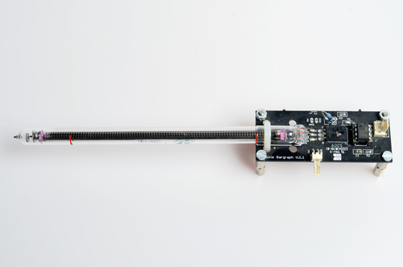
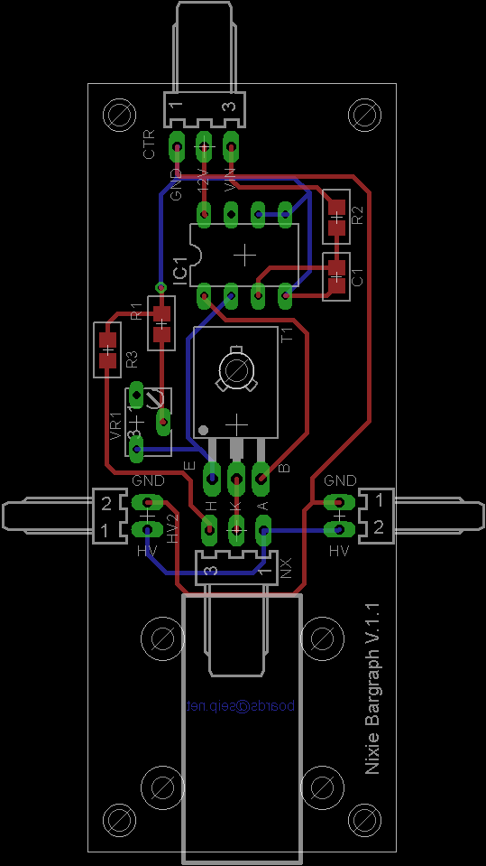

###Nixie-Bargraph

PCB to mount and drive a IN9 nixie bargraph tube. 

[Schematic](Images/Nixie_Bargraph.sch.png)

Made with CadSoft Eagle

###Remarks

It does work quite well, although a very short lifetime of the tubes has defeated the plan I had for their usage. I cannot tell if that has anything to do with my circuit or rather my "new old stock" has actually been a "returned old stock"

###License

[BSD](LICENSE-BSD.txt) for software

[Creative Commons 4.0](LICENSE-CC.txt) for pcb and other artwork

###Copyright
Copyright (c) 2016 Bjoern Seip

